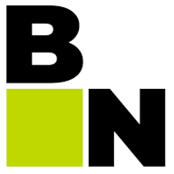

<!-- PROJECT LOGO -->
 

  

<h3 align="center">Balanced News</h3>

  

    Balanced News is a PWA that makes it easy to seek various views and make your own opinion on current news.
     
    <a href="https://github.com/ben-dh3/balanced-news-frontend"><strong>Explore the docs »</strong></a>
     
     
    <a href="https://balancednews.netlify.app/">View Demo</a>
    &middot;
    <a href="https://github.com/ben-dh3/balanced-news-frontend/issues/new?labels=bug&template=bug-report---.md">Report Bug</a>
    &middot;
    <a href="https://github.com/ben-dh3/balanced-news-frontend/issues/new?labels=enhancement&template=feature-request---.md">Request Feature</a>
  

<!-- TABLE OF CONTENTS -->

  
Table of Contents

  <ol>
    <li>
      <a href="#about-the-project">About The Project</a>
      <ul>
        <li><a href="#built-with">Built With</a></li>
      </ul>
    </li>
    <li><a href="#contact">Contact</a></li>
  </ol>

<!-- ABOUT THE PROJECT -->
## About The Project
#### Application Flowchart:

#### Headline Page:
* A list of the top headlines from the NewsAPI.
* A lambda function on the backend finds keywords from the headlines using natural language processing libraries [WinkNLP](https://winkjs.org/wink-nlp/) and [Natural](https://naturalnode.github.io/natural/) and performs a second search on a range of sources to find related articles.
* I have created a collection of sources that provide a range of political perspectives influenced by the [AllSides Media Bias Chart](https://www.allsides.com/media-bias/media-bias-chart), these sources are referenced in the second search query mentioned above.
* The number of related articles found and their political perspective are used to display a percentage distribution of bias for each headline.
  

#### Articles Page:
* A lambda function combines content from the related articles and if there is enough content for a particular perspective, a summary of the articles is generated using the AnthropicAPI.
* If all perspectives (left, right, center) have enough content, then a Bias Comparison is generated along with the summaries. This aims to compare the range of views and provide analysis.
* The related articles are displayed which can be filtered by perspective.
  

(<a href="#readme-top">back to top</a>)

### Built With

* AWS Lambda
* AWS CDK
* DynamoDB
* API Gateway
* Typescript
* VitePWA
* [![React][React.js]][React-url]
* React Query
* localforage
* Tailwind

<!-- CONTACT -->
## Contact

Ben Duffield-Harding - benduffieldharding@gmail.com

Project Link: [https://github.com/ben-dh3/balanced-news-frontend](https://github.com/ben-dh3/balanced-news-frontend)

(<a href="#readme-top">back to top</a>)

<!-- MARKDOWN LINKS & IMAGES -->
<!-- https://www.markdownguide.org/basic-syntax/#reference-style-links -->
[contributors-shield]: https://img.shields.io/github/contributors/github_username/repo_name.svg?style=for-the-badge
[contributors-url]: https://github.com/github_username/repo_name/graphs/contributors
[forks-shield]: https://img.shields.io/github/forks/github_username/repo_name.svg?style=for-the-badge
[forks-url]: https://github.com/github_username/repo_name/network/members
[stars-shield]: https://img.shields.io/github/stars/github_username/repo_name.svg?style=for-the-badge
[stars-url]: https://github.com/github_username/repo_name/stargazers
[issues-shield]: https://img.shields.io/github/issues/github_username/repo_name.svg?style=for-the-badge
[issues-url]: https://github.com/github_username/repo_name/issues
[license-shield]: https://img.shields.io/github/license/github_username/repo_name.svg?style=for-the-badge
[license-url]: https://github.com/github_username/repo_name/blob/master/LICENSE.txt
[linkedin-shield]: https://img.shields.io/badge/-LinkedIn-black.svg?style=for-the-badge&logo=linkedin&colorB=555
[linkedin-url]: https://linkedin.com/in/linkedin_username
[product-screenshot]: images/screenshot.png
[Next.js]: https://img.shields.io/badge/next.js-000000?style=for-the-badge&logo=nextdotjs&logoColor=white
[Next-url]: https://nextjs.org/
[React.js]: https://img.shields.io/badge/React-20232A?style=for-the-badge&logo=react&logoColor=61DAFB
[React-url]: https://reactjs.org/
[Vue.js]: https://img.shields.io/badge/Vue.js-35495E?style=for-the-badge&logo=vuedotjs&logoColor=4FC08D
[Vue-url]: https://vuejs.org/
[Angular.io]: https://img.shields.io/badge/Angular-DD0031?style=for-the-badge&logo=angular&logoColor=white
[Angular-url]: https://angular.io/
[Svelte.dev]: https://img.shields.io/badge/Svelte-4A4A55?style=for-the-badge&logo=svelte&logoColor=FF3E00
[Svelte-url]: https://svelte.dev/
[Laravel.com]: https://img.shields.io/badge/Laravel-FF2D20?style=for-the-badge&logo=laravel&logoColor=white
[Laravel-url]: https://laravel.com
